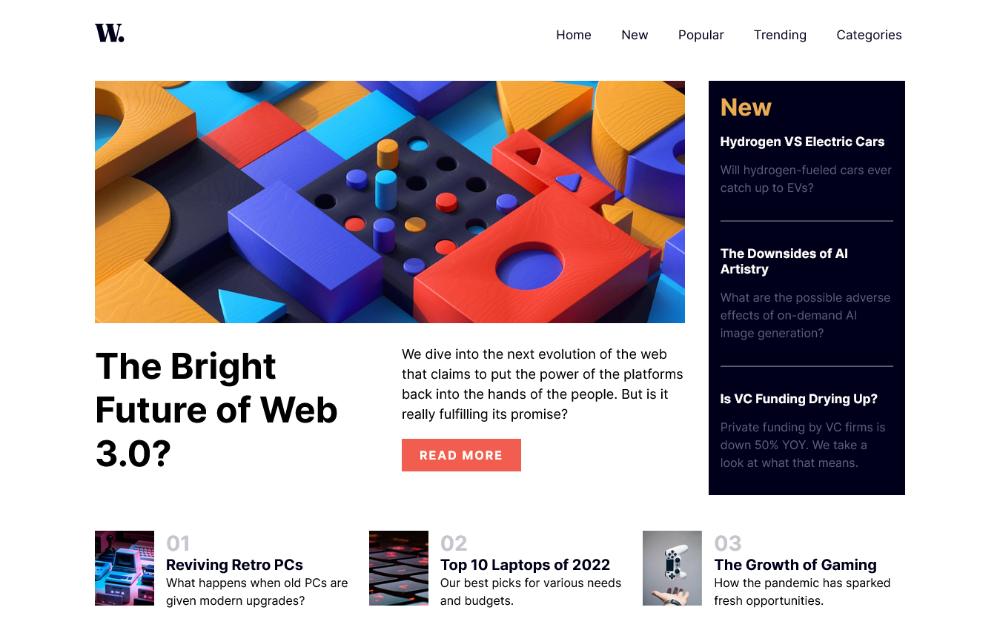
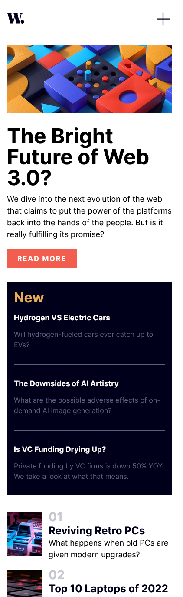

# News Page Challenge Solution

This is a solution to the News Page Challenge from [Frontend Mentor](https://frontendmentor.io)

- [News Page Challenge Solution](#news-page-challenge-solution)
  - [Preview 📷](#preview-)
    - [Desktop Preview 💻](#desktop-preview-)
    - [Mobile Preview](#mobile-preview)
  - [Tools and Languages](#tools-and-languages)
    - [Software and Tools](#software-and-tools)
    - [Languages](#languages)
  - [Links](#links)
    - [Project](#project)
    - [Personal](#personal)

## Preview 📷

See how it looks on different screens.

### Desktop Preview 💻

Preview for desktops

### Mobile Preview

Preview for Mobile phones

## Tools and Languages

### Software and Tools

Different applications used for this project

- [Visual Studio Code](https://code.visualstudio.com)
- Windows 10
- [Firefox](https://mozilla.org/firefox)
- [Brave](https://brave.com)
- Git
- GitHub

### Languages

- HTML
- CSS
- JavaScript

## Links

### Project

- [GitHub Repository](https://github.com/Code-Beaker/news-page-code-beaker)
- [Deploy](https://news-page-code-beaker.vercel.app)

### Personal

- [Website](https://tharun-web.netlify.app)
- [GitHub](https://github.com/code-beaker)
- [Twitter](https://twitter.com/@iamtharunraj)
- [Frontend Mentor](https://frontendmentor.io/profile/Code-Beaker)
